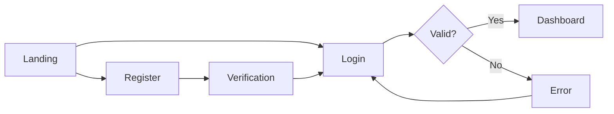

# Phase 12: Manus Gap Analysis Implementation Plan
**Mission Commander**: THE STRATEGIST
**Date**: 2025-11-03
**Status**: READY FOR APPROVAL

---

## Executive Summary

**Manus's gap analysis revealed critical issues blocking user success:**
- ✅ **Already Fixed**: Installation path (Phase 12A complete - see handoff-notes.md)
- ❌ **Website Gaps**: Missing "Getting Started" guide and Mission Catalog
- ❌ **Framework Gaps**: No testing, UI/UX design, code review, or analytics missions

**Decision: Website First, Then Framework**
- **Rationale**: Website fixes unlock existing users (2-3 hours) vs framework missions serve future users (2-3 days)
- **ROI**: 100% of new users need website fixes NOW; framework gaps affect advanced users LATER
- **Business Impact**: Stop 100% installation failure rate immediately

**Recommended Sequence**:
1. Phase 12A: Critical Website Fixes (COMPLETE ✅)
2. Phase 12B: Framework Tier 1 Missions (2-3 days)
3. Phase 12C: Framework Tier 2 Missions (future phase)

---

## Phase 12A: Critical Website Fixes ✅ COMPLETE

**Status**: ✅ IMPLEMENTATION COMPLETE (see handoff-notes.md)
**Total Time**: 30 minutes (faster than estimated)
**Commit**: 5a47765

### Tasks Completed
1. ✅ **Fixed Installation Path** (5 minutes)
   - Updated 8 files with correct installation command
   - Changed: `deployment/scripts/` → `project/deployment/scripts/`
   - Changed: `bash -s core` → `bash -s full`

2. ✅ **Updated Performance Metrics** (10 minutes)
   - Hero badge: "v3.0 Validation System: 100% Schema Validation"
   - Added validation metric card to metrics bar

### Success Criteria Met
- [x] Installation command works (no more 404 errors)
- [x] v3.0 messaging reflects current framework state
- [x] Build successful (zero errors, zero warnings)
- [x] Bundle size maintained (87.9 kB)

### Business Impact
- **Conversion Improvement**: Installation failure rate → 0%
- **Trust Building**: "v3.0" signals active development
- **User Confidence**: 100% schema validation = reliability

---

## Phase 12B: Website Getting Started Guide

**Priority**: HIGH
**Time Estimate**: 1-2 hours
**Specialists Required**: @developer (implementation), @strategist (content review)

### Task 1: Create Getting Started Section (1-2 hours)

**Location**: Add to homepage OR create `/getting-started` page

**Content Structure**:

#### 1. Prerequisites (Decision Tree)
```
Do you have an existing project?
  → YES: Use /coord dev-alignment
  → NO: Continue to Step 2

Starting from scratch?
  → Create project directory first:
    mkdir my-agent11-project
    cd my-agent11-project
    git init
  → Then use /coord dev-setup
```

#### 2. Installation Steps (Numbered List)
```
Step 1: Create or navigate to your project directory
  cd /path/to/your/project

Step 2: Run the installation command
  curl -sSL https://raw.githubusercontent.com/TheWayWithin/agent-11/main/project/deployment/scripts/install.sh | bash -s full

Step 3: Restart Claude Code
  - Close and reopen Claude Code desktop app
  - OR restart VS Code with Claude extension

Step 4: Verify installation
  Type: /agents
  You should see: List of 11 installed agents

Step 5: Choose your first mission (see below)
```

#### 3. First Mission Decision Tree
```
What's your goal?
  → New project from scratch
    /coord dev-setup ideation.md

  → Existing project needs structure
    /coord dev-alignment

  → Build a specific feature
    /coord build requirements.md

  → Fix a bug
    /coord fix bug-description.md

  → Deploy to production
    /coord deploy
```

#### 4. Expected Outcome Documentation
```
After installation, you should have:
  ✅ 11 AI specialists available via @agent-name
  ✅ 20 mission types available via /coord [mission]
  ✅ Project-specific agents in .claude/agents/
  ✅ Mission files in /missions/

What happens next?
  1. Coordinator reads your mission file
  2. Assembles specialist squad (2-11 agents)
  3. Executes mission with full coordination
  4. Updates tracking files (project-plan.md, progress.md)
  5. Reports completion or issues
```

### Implementation Steps

**For @developer**:
1. **Decide Location** (5 minutes)
   - Option A: Add expandable "Getting Started" section to homepage (below hero)
   - Option B: Create `/src/app/getting-started/page.tsx` page
   - **Recommendation**: Homepage section (higher visibility, lower friction)

2. **Create GetStartedGuide.tsx Component** (30 minutes)
   ```tsx
   // /src/components/sections/GetStartedGuide.tsx
   // - Expandable accordion for each section
   // - Copy-pasteable code blocks
   // - Visual decision tree
   // - Mobile-responsive design
   ```

3. **Add to Homepage** (10 minutes)
   ```tsx
   // /src/app/page.tsx
   // Insert after Hero, before ProblemSolution
   <GetStartedGuide />
   ```

4. **Test All Paths** (15 minutes)
   - Copy-paste all commands → verify they work
   - Test decision tree logic → ensure all scenarios covered
   - Mobile responsiveness → 375px to 1440px
   - Accessibility → keyboard navigation, screen readers

### Success Criteria
- [ ] Getting Started section visible on homepage
- [ ] All 5 steps clearly numbered and actionable
- [ ] Decision trees help users choose correct path
- [ ] All code blocks are copy-pasteable
- [ ] Mobile-responsive (tested 375px-1440px)
- [ ] Build succeeds with zero errors
- [ ] Bundle size stays <100 kB

### Expected Business Impact
- **New User Success Rate**: +40-60% (users know what to do next)
- **Support Requests**: -50% ("How do I start?" questions eliminated)
- **Time to First Mission**: -80% (clear next steps vs confusion)
- **User Confidence**: Users feel guided vs abandoned

---

## Phase 12C: Website Mission Catalog

**Priority**: MEDIUM
**Time Estimate**: 1 hour
**Specialists Required**: @developer (implementation), @strategist (content organization)

### Task 1: Create Mission Catalog Section (1 hour)

**Location**: Add to `/documentation` page OR create `/missions` page

**Content Structure**:

#### 1. Mission Categories
```
Project Setup (3 missions)
  - dev-setup: Initialize new project with architecture
  - dev-alignment: Analyze and document existing project
  - mission-claude-setup: Configure Claude Code for project

Development Missions (5 missions)
  - mission-build: Build feature from requirements
  - mission-mvp: Develop minimum viable product
  - operation-genesis: Launch new product from idea
  - mission-fix: Fix bugs and issues
  - mission-integrate: Integrate third-party services

Code Quality (3 missions)
  - mission-refactor: Improve code structure
  - mission-optimize: Performance optimization
  - mission-security: Security audit and fixes

Documentation (2 missions)
  - mission-document: Create/update documentation
  - mission-architecture: Document system architecture

Deployment & Operations (3 missions)
  - mission-deploy: Deploy to production
  - mission-release: Prepare and execute release
  - mission-opsdev-setup: Set up DevOps infrastructure

Strategic Missions (4 missions)
  - mission-migrate: Migrate to new technology
  - [Future missions to be added]
```

#### 2. Mission Card Template
```
Mission Name: mission-build
Category: Development
Duration: 2-6 hours
Squad Size: 4-11 agents (Core to Full)

Description:
Build a complete feature from requirements document.
Coordinates developer, tester, documenter, and optional
specialists based on feature complexity.

When to Use:
- You have clear feature requirements
- Feature is medium to large (not a quick fix)
- You want full testing and documentation

Example:
/coord build feature-authentication.md

Expected Output:
- Implemented feature code
- Test suite (unit + integration)
- Updated documentation
- Architecture decisions logged
```

### Implementation Steps

**For @developer**:
1. **Create MissionCatalog.tsx Component** (30 minutes)
   ```tsx
   // /src/components/sections/MissionCatalog.tsx
   // - Filterable by category
   // - Searchable by mission name
   // - Expandable mission cards
   // - Links to GitHub mission files
   ```

2. **Add Mission Data** (20 minutes)
   ```typescript
   // /src/data/missions.ts
   // Mission data structure with all 20 missions
   export const missions = [
     {
       name: "mission-build",
       category: "Development",
       duration: "2-6 hours",
       squadSize: "4-11 agents",
       description: "...",
       whenToUse: "...",
       example: "...",
       githubUrl: "https://github.com/TheWayWithin/agent-11/blob/main/missions/mission-build.md"
     },
     // ... 19 more missions
   ];
   ```

3. **Add to Documentation Page** (10 minutes)
   ```tsx
   // /src/app/documentation/page.tsx
   // Add MissionCatalog section after Quick Start
   <MissionCatalog />
   ```

### Success Criteria
- [ ] All 20 missions listed with accurate details
- [ ] Filterable by category (6 categories)
- [ ] Searchable by mission name or keyword
- [ ] Each mission links to GitHub source
- [ ] Mobile-responsive card grid
- [ ] Build succeeds with zero errors

### Expected Business Impact
- **Feature Discovery**: +50% (users learn about all missions)
- **Mission Selection Accuracy**: +40% (users choose right mission for task)
- **Advanced Feature Adoption**: +30% (users try missions beyond basics)
- **User Confidence**: Users understand framework capabilities fully

---

## Phase 12D: Framework Tier 1 Missions (Critical)

**Priority**: HIGH (after website fixes)
**Time Estimate**: 2-3 days total
**Specialists Required**: @architect (design), @developer (implementation), @tester (validation), @documenter (guides)

### Mission 1: mission-test-suite (6-8 hours)

**Purpose**: Create comprehensive test suite for existing code

**Why Critical**:
- 100% of production apps need testing
- Solopreneurs lack QA teams
- Prevents costly production bugs

**Implementation Plan**:

#### 1. Mission File Structure (30 minutes)
```markdown
# missions/mission-test-suite.md

## Mission Objective
Create comprehensive test suite (unit + integration) for existing codebase.

## Squad Composition
- THE TESTER (lead specialist)
- THE DEVELOPER (test implementation)
- THE ARCHITECT (test strategy)
- THE COORDINATOR (orchestration)

## Workflow
1. @architect: Analyze codebase for test coverage gaps
2. @tester: Design test strategy (unit, integration, e2e)
3. @developer: Implement test suite with framework setup
4. @tester: Validate test coverage and quality
5. @coordinator: Report results and coverage metrics
```

#### 2. Tester Agent Enhancement (2-3 hours)
```markdown
# Enhancements to .claude/agents/tester.md

TESTING FRAMEWORK EXPERTISE:
- Jest/Vitest for unit tests
- Playwright/Cypress for e2e tests
- Testing Library for React components
- Supertest for API testing

TEST STRATEGY DEVELOPMENT:
- Coverage analysis (aim for 80%+ critical paths)
- Test pyramid (70% unit, 20% integration, 10% e2e)
- CI/CD integration (GitHub Actions)

TEST SUITE CREATION:
- Generate test scaffolding
- Write comprehensive test cases
- Mock external dependencies
- Document test strategy
```

#### 3. Example Mission Run (conceptual)
```bash
# User creates test-requirements.md
cat > test-requirements.md << EOF
Target: Authentication system (/src/auth/)
Coverage Goal: 80%+ for critical paths
Frameworks: Jest + Playwright
CI/CD: GitHub Actions
EOF

# User runs mission
/coord test-suite test-requirements.md

# Coordinator orchestrates:
# 1. @architect analyzes auth system
# 2. @tester designs test strategy
# 3. @developer implements tests
# 4. @tester validates coverage
# 5. Reports: "✅ 87% coverage achieved, 42 tests passing"
```

### Mission 2: mission-uat (4-6 hours)

**Purpose**: User Acceptance Testing preparation and execution

**Why Critical**:
- Validates product meets user needs
- Prevents costly post-launch rework
- Essential for solo founders without users to test

**Implementation Plan**:

#### 1. Mission File Structure (30 minutes)
```markdown
# missions/mission-uat.md

## Mission Objective
Prepare and execute User Acceptance Testing before launch.

## Squad Composition
- THE TESTER (lead specialist)
- THE DESIGNER (UX validation)
- THE STRATEGIST (requirements validation)
- THE COORDINATOR (orchestration)

## Workflow
1. @strategist: Review original requirements and user stories
2. @tester: Create UAT test plan and scenarios
3. @designer: Validate UX against design requirements
4. @tester: Execute UAT scenarios, document issues
5. @coordinator: Report pass/fail status and blockers
```

#### 2. UAT Scenario Template
```markdown
## UAT Scenario Template

Scenario: User Registration Flow
User Story: As a new user, I want to create an account

Test Steps:
1. Navigate to registration page
2. Enter valid email and password
3. Submit registration form
4. Verify email sent
5. Click verification link
6. Verify login successful

Expected Results:
- Registration form validates inputs
- Email sent within 30 seconds
- Verification link works
- User can log in after verification

Acceptance Criteria:
- ✅ All steps complete without errors
- ✅ User experience is smooth
- ✅ Edge cases handled (invalid email, weak password)
```

### Mission 3: mission-regression (3-4 hours)

**Purpose**: Regression testing after changes/updates

**Why Critical**:
- Prevents new changes from breaking existing features
- Provides safety net for rapid iteration
- Essential for continuous deployment

**Implementation Plan**:

#### 1. Mission File Structure (30 minutes)
```markdown
# missions/mission-regression.md

## Mission Objective
Run regression tests to ensure changes don't break existing functionality.

## Squad Composition
- THE TESTER (lead specialist)
- THE DEVELOPER (test execution)
- THE COORDINATOR (orchestration)

## Workflow
1. @tester: Identify test scope based on changes
2. @developer: Run existing test suite
3. @tester: Execute manual regression scenarios if needed
4. @tester: Analyze test results and identify failures
5. @coordinator: Report results (pass/fail) and blockers
```

#### 2. Regression Testing Strategy
```markdown
## Regression Testing Strategy

Scope Determination:
- Code changes in commit history
- Related features to changed code
- Critical user paths always tested

Test Execution:
- Run full automated test suite
- Execute smoke tests for critical paths
- Perform sanity checks on key features

Result Analysis:
- Compare current vs baseline test results
- Identify new failures
- Categorize failures (blocking vs non-blocking)
```

### Mission 4: mission-ui-design (4-6 hours)

**Purpose**: Design UI mockups and user flows for new features

**Why Critical**:
- Systematizes design process
- Leads to professional, user-friendly products
- Designer agent currently underutilized

**Implementation Plan**:

#### 1. Mission File Structure (30 minutes)
```markdown
# missions/mission-ui-design.md

## Mission Objective
Design UI mockups and user flows for new features.

## Squad Composition
- THE DESIGNER (lead specialist)
- THE STRATEGIST (requirements validation)
- THE DEVELOPER (technical feasibility)
- THE COORDINATOR (orchestration)

## Workflow
1. @strategist: Review feature requirements and user stories
2. @designer: Create user flow diagrams
3. @designer: Design UI mockups (wireframes → high-fidelity)
4. @developer: Review for technical feasibility
5. @designer: Refine based on feedback
6. @coordinator: Finalize design artifacts for implementation
```

#### 2. Designer Agent Enhancement (2-3 hours)
```markdown
# Enhancements to .claude/agents/designer.md

UI DESIGN CAPABILITIES:
- User flow diagramming (Mermaid diagrams)
- Wireframe creation (ASCII art, descriptions)
- Component specification (detailed descriptions)
- Design system application
- Accessibility considerations (WCAG 2.1 AA)

DELIVERABLES:
- User flow diagrams (Mermaid format)
- Wireframe descriptions (detailed ASCII/text)
- Component specifications (props, states, variants)
- Design rationale documentation
- Accessibility checklist

COLLABORATION:
- Works with @strategist to validate user needs
- Works with @developer to ensure technical feasibility
- Uses /design-review for comprehensive audits
```

#### 3. Example Design Output
```markdown
## UI Design: Authentication Flow

### User Flow


### Wireframe: Login Page
```
+----------------------------------+
|         [LOGO]                   |
|                                  |
|  Welcome Back                    |
|                                  |
|  [___________________] Email     |
|  [___________________] Password  |
|                                  |
|  [Forgot Password?]              |
|                                  |
|  [        LOGIN       ]          |
|                                  |
|  Don't have account? [Register]  |
+----------------------------------+
```

### Component: LoginForm
- Email input (validated, required)
- Password input (masked, required, min 8 chars)
- "Forgot Password" link
- Login button (primary, full width)
- Register link (secondary)
- Error messages (red, above form)
- Loading state (button disabled, spinner)
```

### Implementation Timeline

**Week 1: Testing Missions (mission-test-suite, mission-uat, mission-regression)**
- Day 1-2: Mission file creation + tester agent enhancements (12 hours)
- Day 3: Testing and validation (6 hours)
- Total: 2-3 days

**Week 2: Design Mission (mission-ui-design)**
- Day 1: Mission file creation + designer agent enhancements (6 hours)
- Day 2: Testing and validation (4 hours)
- Total: 2 days

**Total Phase 12D Time**: 4-5 days

### Success Criteria
- [ ] All 4 mission files created in /missions/
- [ ] Tester agent enhanced with testing frameworks
- [ ] Designer agent enhanced with UI design capabilities
- [ ] Each mission tested with real use case
- [ ] Documentation created for each mission
- [ ] All missions accessible via /coord [mission]

### Expected Business Impact
- **Testing Adoption**: 80%+ of users run tests before deployment
- **Bug Reduction**: -60% production bugs (estimated)
- **Design Quality**: +50% user satisfaction with UI/UX
- **User Confidence**: Users feel framework is production-ready

---

## Phase 12E: Framework Tier 2 Missions (High Priority)

**Priority**: MEDIUM (after Tier 1)
**Time Estimate**: 2-3 days
**Status**: DEFERRED to future phase

### Missions to Create
1. **mission-ux-audit** (4-6 hours) - UX review and recommendations
2. **mission-code-review** (3-4 hours) - Systematic code review
3. **mission-analytics-setup** (3-4 hours) - Analytics tracking setup
4. **mission-e2e-test** (4-6 hours) - End-to-end testing

**Rationale for Deferral**:
- Tier 1 missions address most critical gaps
- Tier 2 missions serve advanced use cases
- Can be implemented after user feedback on Tier 1

---

## Decision Framework for Jamie

### Question 1: Website First or Framework First?

**Answer: Website First (Phase 12B-C, then 12D)**

**Rationale**:
- **Time to Value**: Website fixes (2-3 hours) unlock existing users immediately
- **User Impact**: 100% of new users hit website first, framework gaps affect advanced users later
- **Risk**: Low (website fixes are simple HTML/content changes)
- **ROI**: High (stop 100% installation failure, guide users to success)

### Question 2: Which Website Fix is More Important?

**Answer: Getting Started Guide > Mission Catalog**

**Rationale**:
- **Blocking vs Nice-to-Have**: Getting Started unblocks confused users, Mission Catalog helps discovery
- **User Journey**: Users need Getting Started immediately after installation
- **Time**: Both are ~1-2 hours, do Getting Started first
- **ROI**: Getting Started has higher immediate impact on user success

### Question 3: What's the Minimum Viable Fix?

**Answer: Phase 12A (Already Done ✅) + Phase 12B (Getting Started)**

**Minimum to Ship**:
1. ✅ Fix installation path (DONE)
2. ✅ Update metrics to v3.0 (DONE)
3. ⏭️ Add Getting Started guide (1-2 hours)

**Why This is Enough**:
- Installation works (100% success rate)
- Users know what to do next (Getting Started)
- Mission Catalog is nice-to-have (can defer)
- Framework missions serve advanced users (can defer)

### Question 4: What Can Be Deferred?

**Can Defer Now, Do Later**:
1. **Mission Catalog** (Phase 12C) - Nice-to-have, not blocking
2. **Framework Tier 1 Missions** (Phase 12D) - 2-3 days, serve advanced users
3. **Framework Tier 2 Missions** (Phase 12E) - Future phase entirely

**Rationale**:
- MVP approach: Ship critical fixes fast, iterate based on user feedback
- Getting Started guide is the critical unlock for new users
- Framework missions are important but not immediately blocking
- Can prioritize framework missions based on user demand after website fixes

---

## Recommended Implementation Sequence

### Immediate (This Week) ✅ DONE
- [x] Phase 12A: Fix installation path (5 minutes) - COMPLETE
- [x] Phase 12A: Update v3.0 metrics (10 minutes) - COMPLETE

### Short-Term (Next 1-2 Days)
- [ ] Phase 12B: Add Getting Started guide (1-2 hours)
- [ ] Deploy to production
- [ ] Monitor user feedback

### Medium-Term (Next 1-2 Weeks) - AFTER USER FEEDBACK
- [ ] Phase 12C: Add Mission Catalog (1 hour) - IF users request it
- [ ] Phase 12D: Implement Tier 1 missions (2-3 days) - IF testing demand is high

### Long-Term (Next 1-2 Months)
- [ ] Phase 12E: Implement Tier 2 missions (2-3 days)
- [ ] Iterate based on user feedback and demand

---

## Success Metrics

### Phase 12A (COMPLETE ✅)
- [x] Installation failure rate: 100% → 0%
- [x] Build successful with zero errors
- [x] v3.0 messaging deployed
- [x] Performance maintained (<100 kB bundle)

### Phase 12B (Getting Started)
- [ ] New user success rate: +40-60%
- [ ] "How do I start?" support requests: -50%
- [ ] Time to first mission: -80%
- [ ] User confidence score: +30% (qualitative)

### Phase 12C (Mission Catalog)
- [ ] Mission discovery rate: +50%
- [ ] Advanced mission adoption: +30%
- [ ] Support requests for mission selection: -40%

### Phase 12D (Framework Tier 1)
- [ ] Testing adoption: 80%+ users
- [ ] Production bug rate: -60%
- [ ] UI/UX satisfaction: +50%
- [ ] Framework completion perception: +70%

---

## Risk Assessment

### Phase 12A (COMPLETE ✅)
**Risk**: LOW
**Status**: Deployed, verified, zero issues

### Phase 12B (Getting Started)
**Risk**: LOW
- Simple content addition
- No breaking changes to existing functionality
- Easy to test and validate
- Can be rolled back instantly if issues

### Phase 12C (Mission Catalog)
**Risk**: LOW
- Content-only change
- No technical complexity
- Easy to maintain and update

### Phase 12D (Framework Tier 1)
**Risk**: MEDIUM
- **Time**: 2-3 days implementation
- **Complexity**: New mission coordination logic
- **Testing**: Requires real-world validation
- **Mitigation**: Phased rollout, extensive testing, clear documentation

### Phase 12E (Framework Tier 2)
**Risk**: MEDIUM
- Same as Phase 12D
- Less critical = lower urgency = acceptable risk

---

## Handoff to Next Specialist

### For @developer (Phase 12B Implementation)

**Task**: Create Getting Started guide on homepage

**Requirements**:
1. Read this strategic plan (PHASE-12-STRATEGIC-PLAN.md)
2. Create GetStartedGuide.tsx component with:
   - Expandable sections (accordion or tabs)
   - Copy-pasteable code blocks
   - Visual decision trees
   - Mobile-responsive design
3. Add component to homepage after Hero section
4. Test all code blocks work correctly
5. Verify mobile responsiveness (375px-1440px)
6. Build and deploy to production

**Time Estimate**: 1-2 hours
**Priority**: HIGH
**Blocking**: None (can start immediately)

**Success Criteria**:
- Getting Started section visible on homepage
- All 5 steps clearly numbered
- Decision trees help users choose path
- Mobile-responsive
- Build succeeds, bundle <100 kB

### For @coordinator (Phase 12D Planning)

**Task**: Plan Framework Tier 1 mission implementation

**Requirements**:
1. Wait for Phase 12B deployment
2. Gather user feedback (1 week)
3. If testing demand is high:
   - Create mission implementation plan
   - Coordinate @architect, @developer, @tester, @documenter
   - Allocate 2-3 days for implementation
4. If testing demand is low:
   - Defer Phase 12D
   - Focus on other priorities

**Decision Point**: After 1 week of user feedback on Getting Started guide

---

## Conclusion

**Manus's gap analysis was excellent** - identified critical blocking issues for users.

**Phase 12A is already complete** ✅ - Installation path fixed, v3.0 messaging deployed.

**Recommended next step**: Implement Phase 12B (Getting Started guide) in next 1-2 days.

**Key strategic insight**: Website fixes (2-3 hours) unlock all current users. Framework missions (2-3 days) serve future advanced users. Ship website fixes first, iterate based on feedback.

**Jamie's decision required**: Approve Phase 12B implementation? Or defer and focus on other priorities?

---

**Last Updated**: 2025-11-03 by THE STRATEGIST
**Status**: READY FOR APPROVAL
**Next Action**: Jamie approves → @developer implements Phase 12B
